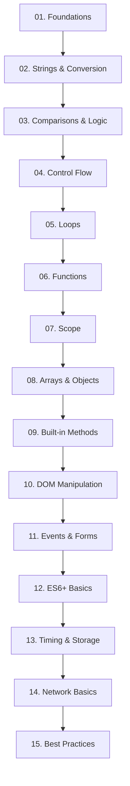

# JavaScript Bootcamp Notes 📚

Welcome to the JavaScript Bootcamp Notes! This comprehensive collection covers all essential JavaScript concepts for beginners, organized according to the bootcamp syllabus.

## 📖 Table of Contents

### 🔰 **Foundations**

- [**01. Foundations**](./01-foundations.md) - Variables (`let`, `const`), data types, console, operators
- [**02. Strings and Conversion**](./02-strings-and-conversion.md) - String manipulation, template literals, type conversion
- [**03. Comparisons and Logic**](./03-comparisons-and-logic.md) - Comparison operators, logical operators, truthiness

### 🔁 **Control Flow**

- [**04. Control Flow**](./04-control-flow.md) - `if`, `else`, `switch`, conditional statements
- [**05. Loops**](./05-loops.md) - `for`, `while`, `for...of`, `break`, `continue`

### 🧠 **Functions**

- [**06. Functions**](./06-functions.md) - Declarations, expressions, arrow functions, parameters, return values
- [**07. Scope**](./07-scope.md) - Global scope, local scope, block scope, scope chain

### 📦 **Arrays & Objects**

- [**08. Arrays and Objects**](./08-arrays-and-objects.md) - Creation, access, array methods (`push`, `map`), object properties

### 🛠️ **Built-in Methods**

- [**09. Built-in Methods**](./09-built-in-methods.md) - String methods, Number methods, Math object

### ✨ **DOM Manipulation**

- [**10. DOM Manipulation**](./10-dom-manipulation.md) - Selecting, modifying, creating, removing elements

### 🔄 **Forms & Events**

- [**11. Events and Forms**](./11-events-and-forms.md) - `addEventListener`, form inputs, event object

### 🚀 **Modern JavaScript**

- [**12. ES6+ Basics**](./12-es6-basics.md) - Destructuring, template literals, default parameters
- [**13. Timing and Storage**](./13-timing-and-storage.md) - `setTimeout`, `setInterval`, `localStorage`
- [**14. Network Basics**](./14-network-basics.md) - `fetch`, promises, `.then()`, `.catch()`, `JSON`

### 🧼 **Best Practices**

- [**15. Best Practices**](./15-best-practices.md) - Readability, naming, comments, clean code

---

## 🎯 How to Use These Notes

### For Beginners

1. **Start with Foundations** - Master variables, data types, and basic operations
2. **Progress Sequentially** - Each topic builds on previous concepts
3. **Practice Examples** - Try all code examples in your browser console
4. **Do Exercises** - Complete practice exercises at the end of each section

### For Review

- Use the **Table of Contents** to jump to specific topics
- Each note includes **Key Takeaways** for quick reference
- **Practice Exercises** help reinforce learning

### For Instructors

- Notes follow the **official bootcamp syllabus**
- Each topic is **self-contained** but builds on previous concepts
- **Practical examples** demonstrate real-world applications
- **Common pitfalls** section helps prevent typical mistakes

---

## 📋 Learning Path



---

## 🎓 What You'll Learn

By completing these notes, you'll have a solid foundation in:

- **JavaScript Fundamentals**: Variables, data types, operators
- **Program Control**: Conditionals, loops, functions
- **Data Structures**: Arrays and objects manipulation
- **DOM Interaction**: Making web pages dynamic
- **Event Handling**: Responding to user interactions
- **Modern JavaScript**: ES6+ features for cleaner code
- **Asynchronous Programming**: Working with APIs and timing
- **Professional Practices**: Writing clean, maintainable code

---

## 🔗 Quick Reference

### Essential Concepts

- **Variables**: `let`, `const` for declaration
- **Functions**: Reusable blocks of code
- **Arrays**: Ordered lists of data
- **Objects**: Key-value pairs for structured data
- **DOM**: Interface to HTML elements
- **Events**: Responding to user interactions
- **Promises**: Handling asynchronous operations

### Common Patterns

```javascript
// Variable declaration
const name = "JavaScript";
let score = 0;

// Function definition
function greet(name) {
  return `Hello, ${name}!`;
}

// Array manipulation
const numbers = [1, 2, 3];
const doubled = numbers.map((n) => n * 2);

// Object creation
const user = {
  name: "Alice",
  age: 25,
};

// DOM selection
const button = document.querySelector("#my-button");

// Event handling
button.addEventListener("click", () => {
  console.log("Button clicked!");
});

// API request
fetch("/api/data")
  .then((response) => response.json())
  .then((data) => console.log(data));
```

---

## 📝 Study Tips

1. **Practice Regularly**: Code every day, even if just for 15 minutes
2. **Build Projects**: Apply concepts in real projects
3. **Use Developer Tools**: Learn to debug with browser DevTools
4. **Read Others' Code**: Study well-written JavaScript code
5. **Join Communities**: Engage with other JavaScript learners

---

## 🚀 Next Steps

After mastering these fundamentals:

1. **Frameworks**: Learn React, Vue, or Angular
2. **Node.js**: Server-side JavaScript
3. **Advanced Topics**: Closures, prototypes, async/await
4. **Tools**: Webpack, npm, testing frameworks
5. **Projects**: Build portfolio projects

---

## 📧 Getting Help

If you need clarification on any topic:

1. **Re-read the section** - Sometimes a second reading helps
2. **Try the examples** - Hands-on practice reveals understanding gaps
3. **Check MDN Documentation** - Comprehensive JavaScript reference
4. **Ask questions** - Don't hesitate to seek help from instructors or peers

---

## 🎉 Happy Coding!

Remember: Learning JavaScript is a journey, not a destination. Take your time, practice regularly, and don't be afraid to make mistakes. Every error is a learning opportunity!

**Good luck with your JavaScript journey! 🚀**

---

_Last updated: December 2024_  
_Based on JavaScript Bootcamp Syllabus v1.0_
